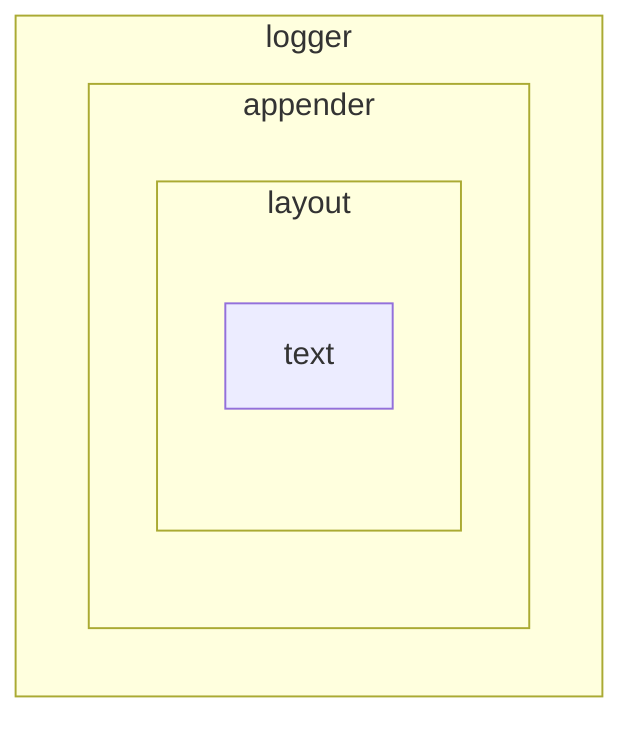

# 配置文件
```xml
<configuration>
    <appender name="STDOUT" class="ch.qos.logback.core.ConsoleAppender">
        <encoder>
            <pattern>%d{HH:mm:ss.SSS} [%thread] %-5level %logger{36} - %msg%n</pattern>
        </encoder>
    </appender>
    <root level="debug">
        <appender-ref ref="STDOUT" />
    </root>
</configuration>
```
# 转义字符

| character     | description  |
| ------------- | ------------ |
| ``logger``    | 日志对象     |
| ``date``      | 时间         |
| ``file``      | 文件         |
| ``line``      | 行号         |
| ``message``   | 消息         |
| ``method``    | 方法         |
| ``n``         | 换行符       |
| ``level``     | 级别         |
| ``relative``  | 程序执行时间 |
| ``thread``    | 线程         |
| ``mdc``       | ``mdc``      |
| ``exception`` | 异常堆栈     |

更多信息搜索``PatternLayout.java``

# 格式字符

| example            | description                      | min          | max        |
| ------------------ | -------------------------------- | ------------ | ---------- |
| ``%20logger``      | 长度20，不够左边补空白           | 20           | $+ \infty$ |
| ``%-20logger``     | 长度20，不够右边补白             | 20           | $+\infty$  |
| ``%.30logger``     | 截取后30字符                     | 0            | 30         |
| ``%20.30logger``   | 少于20左补空白，多余30截取后三十 | 20           | 30         |
| ``%-20.-30logger`` | 少于20右补空白，多余30截取前三十 | 20           | 30         |
| ``%logger{30}``    | ``logger``打印长度               | 最后名称长度 | $+\infty$  |

# 格式阅读

```xml
 <pattern>%d{HH:mm:ss.SSS} [%thread] %-5level %logger{36} - %msg%n</pattern>
```

- 时间格式
- 线程名字
- 等级，长度小于5左补空格
- 日志名称，最长36
- 消息
- 换行

# 层级



- ``text``：日志消息
- ``layout``：消息格式
- ``appender``：消息输出
- ``logger``：日志对象

## text

这个就不说了

## layout

一般来说，常用的都是``PatternLayout``，默认不指定的情况下使用的就是它。

至于``append``，文件中的是

```xml
<appender name="STDOUT" class="ch.qos.logback.core.ConsoleAppender">
```

从名字来看，它是输出到控制台的。我们还可以替换为

```xml
<appender name="STDOUT" class="ch.qos.logback.core.FileAppender">
        <file>godme.log</file>
        <encoder>
            <pattern>%d{HH:mm:ss.SSS} [%thread] %-5level %logger{36} - %msg%n</pattern>
        </encoder>
    </appender>
```

使用``FileAppender``，然后指定文件名，它就输出到了文件。

更多的，我们可以输出到``socket``，``redis``，``MySQL``等其他地方，如果使用其他``appender``的话。

如果都不适用，还可以自己编写，自定义``appender``。

## logger

在这里面，我们使用的是``root``。

``root``作为日志的祖先，相当于``java``中的``Object``。我们获取的日志对象，其他东西就是继承它的。

现在，我们自己写一个明白一些的。

```xml
<configuration>
    <appender name="STDOUT" class="ch.qos.logback.core.FileAppender">
        <file>godme.log</file>
        <encoder>
            <pattern>%d{HH:mm:ss.SSS} [%thread] %-5level %logger{36} - %msg%n</pattern>
        </encoder>
    </appender>
    <logger name="godme">
        <appender-ref ref="STDOUT" />
    </logger>
    <!--<root level="debug">-->
        <!--<appender-ref ref="STDOUT" />-->
    <!--</root>-->
</configuration>
```

一个日志对象，名称叫做``godme``，没毛病

```java
 	private static Logger log = LoggerFactory.getLogger("godme");
```

通过名称获取，这就直接拿到了。

不过，如果不是进行日志的业务划分，大部分场景下都是通过类直接获取日志对象，用``ROOT``进行总控。

如果需要更细节的定制，那么就去慢慢配置吧。

值得申明的是，一个``logger``下面是可以配置多个``appender``的，可以同时向多个目的地输出。

> ## 消息叠加
>
> 如果直接运行，你会发现，消息打印了两条。
>
> 这是因为``appender``默认会把消息发送到每个引用的``logger``。
>
> 一条消息就是``godme``发送的，另个就是``root``了。
>
> 如果不想让日志继续向上传播，就设置一下传播属性``additivity``为``false``。
>
> ```xml
>     <logger name="godme" additibity="false">
>         <appender-ref ref="STDOUT" />
>     </logger>
> ```
>
> 当消息就是此日志对象打印的，那么仅有当前日志进行打印。
>
> 但如果是子类的对象打印的，拦截之前，发源点经过的日志对象都会进行打印。

# MDC

搭建``ELK``最麻烦的，就是编写``logstash``的正则解析了，因为原有日志实在太不规范。

一个正则无法匹配全部的日志，但是我们却可以在打印的时候进行统一的规格。

```xml
<pattern>%d{HH:mm:ss.SSS} [%thread] %-5level %logger{36} - username: %X{username} age : %X{age} %msg%n</pattern>
```

```java
public class Config {
    private static Logger log = LoggerFactory.getLogger(Config.class);
    public static void main(String[] args) {
        MDC.put("username", "godme");
        MDC.put("age", "32");
        log.info("i am godme");
        MDC.put("username", "judas");
        MDC.put("age", "99");
        log.info("i am judas");
    }
}
```

这样，实在是方便多了

```properties
20:50:08.578 [main] INFO  com.godme.logback.chapter2.Config - username: godme age : 32 i am godme
20:50:08.579 [main] INFO  com.godme.logback.chapter2.Config - username: judas age : 99 i am judas
```

作为非日志的填充，和消息无关，并且可以提示出业务或者用户还是你所想的基本环境。

最棒的是，如果只有入口进行身份验证，后续如果想要打印用户信息，那将是不可能的，除非你从其他地方获取。

但是使用``MDC``，入口处填充一下就好了，无需其他操作。

当然，不过不需要了，还可以进行``remove``.